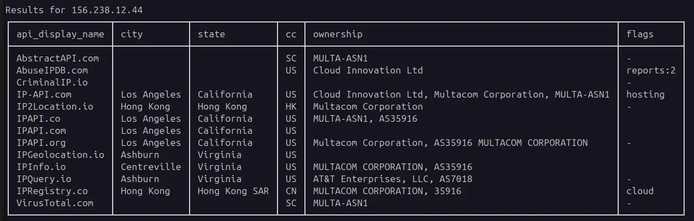

# ip_info

A Python command-line tool for quickly querying IP address information from
multiple providers.

In security work you often need geolocation and reputation information for an IP
address, and because results are inconsistent between providers the most
reliable approach is to check several at once. `ip_info` does that for you: it
queries up to 15 free providers in parallel and returns the results in a few
seconds.

## Features

- Checks up to 15 free providers in parallel and returns results in seconds.
- Accepts IPv4 and IPv6 addresses, and supports bulk queries where the provider
  allows it.
- Validates addresses first, discarding invalid and reserved IPs to avoid
  wasting queries.
- Can parse IP addresses out of clipboard text for easier multi-IP input.
- Keeps a local SQLite database of past queries to avoid looking up the same IP
  twice.

## Where to next

- **[Install](install.md)** — get `ip_info` set up with uv or pip.
- **[Usage](usage.md)** — look up addresses, parse the clipboard, choose the
  output format and providers.
- **[Providers](providers.md)** — the supported providers and how to store their
  API keys.
- **[Reference](reference/ip_info.md)** — auto-generated API documentation.
