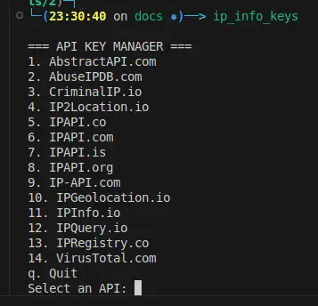
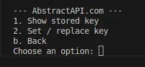
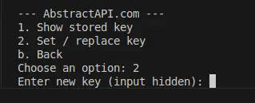

# Providers

`ip_info` can query the 14 providers below. Four require no registration; the
rest offer a free tier that needs an API key. Use the **name** column with
`--apis` to query a specific provider (see [Usage](usage.md)).

## Adding API keys

API keys are stored encrypted at rest using the
[`keyring`](https://pypi.org/project/keyring/) library, so they are never kept
in the repository or in plain text.

To add or update a key, run `ip_info_keys` and enter the number of the provider:

```
ip_info_keys
```



Choose `2` to set a new key:



Enter the key:



## Available providers

| Provider | `--apis` name | Key | Notes |
|---|---|---|---|
| [AbstractAPI.com](https://app.abstractapi.com/users/signup) | `abstractapicom` | Required | High rate limit (1/sec). |
| [AbuseIPDB.com](https://www.abuseipdb.com/register?plan=free) | `abuseipdbcom` | Required | Abuse reports; high limit (1k/day); no location data. |
| [CriminalIP.io](https://www.criminalip.io/register) | `criminalipio` | Required | Good security information; low limit (50/month). |
| IP-API.com | `ipdashapicom` | Not required | High rate limit; supports bulk queries. |
| [IP2Location.io](https://www.ip2location.io/sign-up?ref=5) | `ip2locationio` | Optional | High limit (1k/day, more with a key); location, ASN, proxy only. |
| IPAPI.co | `ipapico` | Not required | High limit (1k/day); bulk; location and ASN only. |
| [IPAPI.com](https://ipapi.com/signup/free) | `ipapicom` | Required | Low limit (100/month); location only. |
| [IPAPI.is](https://ipapi.is/app/signup) | `ipapiis` | Required | Security and risk data; high limit (1k/day); bulk. |
| [IPAPI.org](https://members.ipapi.org/registration_form.php) | `ipapiorg` | Required | High limit (1k/day); bulk. |
| [IPGeolocation.io](https://app.ipgeolocation.io/signup) | `ipgeolocationio` | Required | High limit (1k/day); location only. |
| [IPInfo.io](https://ipinfo.io/signup) | `ipinfoio` | Required | No rate limit; location only. |
| IPQuery.io | `ipqueryio` | Not required | High limit; bulk; good security information. |
| [IPRegistry.co](https://dashboard.ipregistry.co/signup) | `ipregistryco` | Required | Good security information; 100k queries per account. |
| [VirusTotal.com](https://www.virustotal.com/gui/join-us) | `virustotalcom` | Required | Good security information; trusted provider; low limit (4/min, 500/day). |

## Suggesting a provider

Know a provider that isn't listed? Contributions are welcome — see
[CONTRIBUTING.md](https://github.com/DrollRobot/ip_info/blob/main/CONTRIBUTING.md).
Providers that need no key, have a high rate limit, and return good security
information (Tor/VPN detection, risk scores, abuse reports) are especially
useful.
