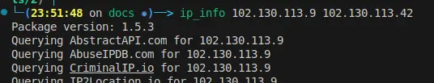
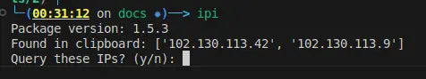
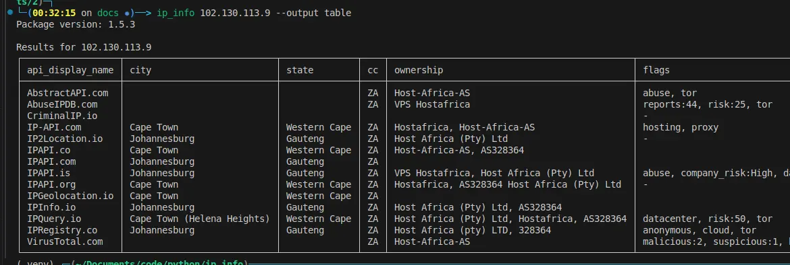
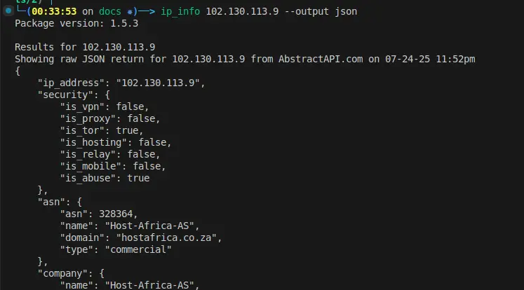
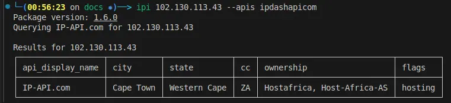

# Usage

## Looking up IP addresses

Pass one or more addresses on the command line:

```
ip_info 1.2.3.4 8.8.8.8       # or the short alias: ipi
```



If you don't pass any addresses, `ip_info` reads the text on your clipboard and
extracts any IP addresses it finds. Invalid and reserved addresses are
discarded:

```
ip_info
```



## Output format

View the results as a table with `--output table` (the default):



Or view the raw JSON with `--output rawjson`:

```
ip_info 1.2.3.4 --output rawjson
```



## Choosing which providers to query

By default, `ip_info` queries every provider that has a key saved in the keyring,
plus every provider that does not require a key.

To query specific providers, use `--apis` with one or more provider names:

```
ip_info 1.2.3.4 --apis virustotalcom ipqueryio
```



!!! note
    The output shows data from every provider that has results saved in the
    local database for the given IP, even if you only queried a subset this run.

See **[Providers](providers.md)** for the full list of provider names and how to
add API keys.
